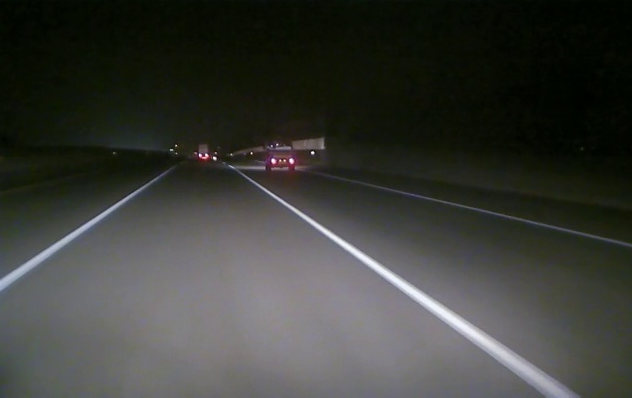
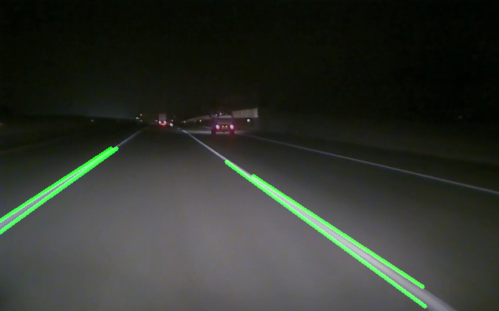
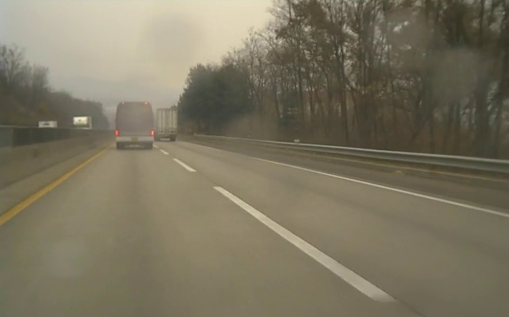
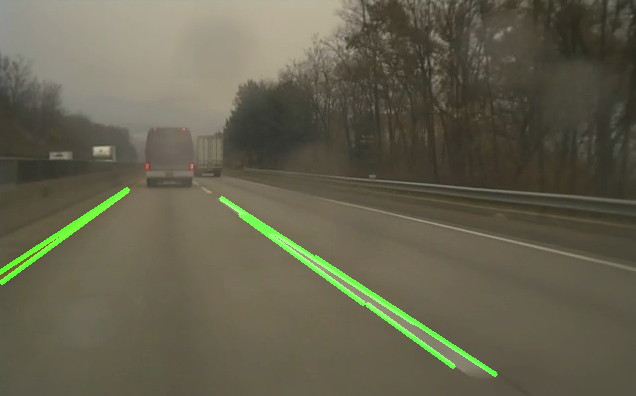

# Lane Line Detection Using OpenCV

This project detects lane lines in videos recorded in **nighttime** and **rainy** conditions using image processing techniques and the **Hough Transform**. It is designed to work with videos or extracted frames.

## 👉 Features

- ✅ Detects lane lines in videos during night and rain conditions.  
- ✅ Converts videos into frames for further analysis.  
- ✅ Supports both **video output** and **frame-based processing**.  
- ✅ Uses **CLAHE, edge detection, and Hough Transform** for accuracy.  
- ✅ Optimized for **real-world conditions** (low light, rain, etc.).  

---

## 📁 Project Structure

```
LANE-LINE-DETECTION/
│── dataset/                        # Raw dataset (videos)
│   ├── hujan/                      # Rainy videos
│   ├── malam/                      # Night videos
│   ├── Night-640x400-4fps/         # Night video data with 640x400 resolution 4fps
│   ├── Rain-640x400-4fps/          # Rain video data with 640x400 resolution 4fps
│
│── hasil-percobaan/                # Experimental results
│   ├── Hujan/
│   ├── Malam/
│   ├── HasilPercobaan.docx
│
│── out/                             # Processed results (videos & frames)
│   ├── frames/
│   │   ├── HoughTransform(N)/
│   │   ├── HoughTransform(R)/
│   │   ├── hujan/
│   │   ├── malam/
│   ├── N27.avi
│   ├── N28.avi
│
│── samples/                         # Sample images/videos for quick testing
│   ├── frames/
│   │   ├── hujan/
│   │   ├── malam/
│   ├── sources/
│
│── src/                             # Source code (main logic)
│   ├── hough_transform.py           # Final lane detection model
│   ├── percobaan.py                 # Experimenting different techniques
│   ├── video2frame.py               # Converts videos into frames
│
│── requirements.txt                  # Python dependencies
│── README.md                         # Project documentation
│── .gitignore                         # Ignore unnecessary files
```

---

## 🛠 Installation

### 1️⃣ Clone the Repository
```bash
git clone https://github.com/astikaist/lane-line-detection.git
cd lane-line-detection
```

### 2️⃣ Install Dependencies
Ensure you have Python installed (>= 3.7), then run:
```bash
pip install -r requirements.txt
```

---

## 🚀 Usage

### 1️⃣ Convert Video to Frames
If you want to **process frames** instead of the whole video, first extract frames:
```bash
python src/video2frame.py --input dataset/malam/night-65.avi --output dataset/malam/frames/
```
This will save all frames as images in `dataset/malam/frames/`.

---

### 2️⃣ Run Lane Detection on Frames
To process images (frames extracted from a video):
```bash
python src/hough_transform.py --input dataset/malam/frames/ --output out/frames/malam/
```
The processed frames will be saved in `out/frames/malam/`.

---

### 3️⃣ Run Lane Detection on Video
To process the video directly:
```bash
python src/hough_transform.py --input dataset/malam/night-65.avi --output out/N65_processed.avi
```
This will generate an **output video with detected lane lines**.

---

## 🖼 Sample Results

| Input | Output |
|-------|--------|
|  |  |
|  |  |

---

## ⚙️ How It Works
This project applies **several image processing techniques** to extract lane lines:
1. **Convert to Grayscale**
2. **Apply Median Filtering** (Noise Reduction)
3. **Use CLAHE (Contrast Limited Adaptive Histogram Equalization)**
4. **Detect Edges with Canny Edge Detection**
5. **Apply Region of Interest Masking**
6. **Use Hough Line Transform to Detect Lane Lines**
7. **Draw Detected Lanes on the Original Image**

---

## 📜 Experiments and Development
- `percobaan.py`: Contains various **image processing experiments** before finalizing the best technique.
- `video2frame.py`: **Prepares frames from videos** if you want to use frame (images) instead of video data.
- `hough_transform.py`: **Final lane detection algorithm** using optimized techniques.

---

## 📈 To-Do List
✔ Improve lane stability with temporal filtering  
✔ Add lane curvature estimation  
✔ Improve real-time processing speed  
✔ Add support for different resolutions  

---

## 📢 Contributing
🚀 If you find any issues or want to contribute, feel free to fork this repository and submit a Pull Request!

---

## 🔗 References
- OpenCV Documentation: [https://opencv.org](https://opencv.org)
- Hough Transform Theory: [Wikipedia](https://en.wikipedia.org/wiki/Hough_transform)

---

## 📚 License
This project is licensed under the **MIT License**.